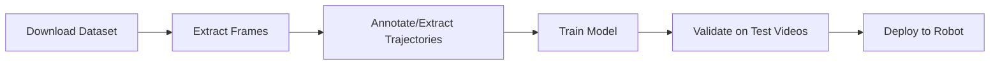

# RamArm Training Data Platform Guide

## 🎯 Overview

This platform ensures high-quality robot training data through automated validation, standardization, and easy distribution. Anyone can record and upload videos, but only quality-validated data becomes available for robot training.

## 📹 Video Recording Standards

### Requirements for Training-Quality Videos

1. **Format & Quality**
   - Format: MP4 (auto-converted on upload)
   - Resolution: Minimum 640x480 (higher recommended)
   - Frame Rate: 30fps minimum (60fps preferred)
   - Duration: 5-60 seconds per action
   - Lighting: Well-lit, consistent lighting
   - Stability: Stable camera position (tripod recommended)

2. **Recording Devices**
   - Ray-Ban Meta Smart Glasses (preferred)
   - Smartphones (good alternative)
   - Action cameras (GoPro, etc.)
   - Webcams (minimum quality)

3. **Content Guidelines**
   - **Clear Action**: One complete action per video
   - **Full Visibility**: Entire motion path visible
   - **No Obstructions**: Clear view of robot/hand movement
   - **Consistent Speed**: Natural, repeatable motion
   - **Clean Background**: Minimal distractions

## 🔄 Upload Process & Validation

### What Happens When You Upload

1. **Automatic Processing**
   ```
   Upload → Format Conversion → Quality Check → Thumbnail Generation → Metadata Extraction
   ```

2. **Format Standardization**
   - All videos converted to MP4 (H.264)
   - Audio normalized to AAC 128kbps
   - Consistent encoding for robot processing

3. **Metadata Capture**
   - Video duration
   - Frame rate
   - Resolution
   - Recording timestamp
   - Upload timestamp
   - Recording device (if available)

### Video States

- **Pending**: Just uploaded, awaiting analysis
- **Processing**: Being analyzed for motion patterns
- **Analyzed**: Ready for categorization
- **Published**: Available as training data in marketplace

## 🏷️ Categorization System

### Motion Categories

1. **Pick & Place**
   - Grasping objects
   - Moving items between locations
   - Placement accuracy tasks

2. **Welding**
   - Continuous motion paths
   - Arc patterns
   - Linear trajectories

3. **Assembly**
   - Part insertion
   - Screw driving
   - Component fitting

4. **Packaging**
   - Box folding
   - Sealing motions
   - Label application

5. **Visual Inspection**
   - Scanning patterns
   - Multi-point examination
   - Quality check movements

6. **Material Handling**
   - Sorting motions
   - Stacking patterns
   - Transfer operations

## 📦 Publishing to Marketplace

### Before Publishing

✅ **Checklist**:
- [ ] Video is analyzed
- [ ] Correct category assigned
- [ ] Clear, descriptive name
- [ ] Company/source identified
- [ ] Industry context provided
- [ ] Motion specialty described

### Publishing Process

1. **Open Publish Modal** (green arrow button)
2. **Fill Required Fields**:
   - Model Name (what this motion teaches)
   - Category (type of motion)
   - Company (who created it)
   - Industry (application context)
   - Specialty (specific motion description)
   - Pricing (free or paid credits)

3. **Automatic Dataset Creation**:
   - Groups all videos in same category
   - Calculates total trajectories
   - Estimates dataset size
   - Generates accuracy metrics

## 💾 Downloading Training Data

### Dataset Package Contents

When someone downloads your published model, they receive:

```json
{
  "metadata": {
    "model_name": "Advanced Pick & Place",
    "company": "AutoLine GmbH",
    "category": "Pick & Place",
    "total_videos": 15,
    "total_trajectories": "340",
    "accuracy": "98.5%",
    "video_format": "MP4",
    "resolution": "640x480 or higher",
    "frame_rate": "30fps minimum"
  },
  "videos": [
    {
      "id": "...",
      "title": "Pick & Place - Station A7",
      "video_url": "https://...",
      "thumbnail_url": "https://...",
      "duration": 45,
      "recorded_at": "2025-01-15T10:30:00Z"
    }
  ],
  "readme": "# Dataset Instructions...",
  "download_instructions": {
    "step_1": "Download this metadata package",
    "step_2": "Download individual videos from URLs",
    "step_3": "Organize files for training"
  }
}
```

### Download Flow

1. **Browse Marketplace** → Find desired motion model
2. **Click "Download Training Dataset"** → Receives JSON package
3. **Download Videos** → Use URLs in JSON to fetch videos
4. **Train Robot** → Use videos with your ML pipeline

## 🤖 Using Data for Robot Training

### Recommended Workflow



### Integration Examples

#### 1. Computer Vision Pipeline
```python
# Extract frames from video
frames = extract_frames(video_url)

# Detect key points (hands, tools, objects)
keypoints = detect_keypoints(frames)

# Extract trajectory
trajectory = extract_motion_path(keypoints)

# Train robot controller
model.train(trajectory, action_label)
```

#### 2. Imitation Learning
```python
# Load video dataset
dataset = load_training_dataset("pick_place.json")

# Process each video
for video in dataset['videos']:
    states, actions = process_video(video['video_url'])
    demonstrations.append((states, actions))

# Train policy network
policy.fit(demonstrations)
```

## 🔒 Data Quality Assurance

### Automated Checks

- ✅ Video format validation
- ✅ Resolution verification
- ✅ Duration limits
- ✅ File size checks
- ✅ Corruption detection

### Manual Verification (Future)

- 🔄 Community ratings
- 🔄 Expert review system
- 🔄 Quality badges
- 🔄 Training effectiveness metrics

## 📊 Metadata Standards

### Required Metadata
```json
{
  "title": "Pick & Place - Station A7",
  "category": "Pick & Place",
  "duration": 45,
  "recorded_at": "2025-01-15T10:30:00Z",
  "source": "uploaded",
  "status": "analyzed"
}
```

### Optional Enhanced Metadata
```json
{
  "recording_device": "Ray-Ban Meta v2",
  "environment": "factory_floor",
  "lighting_conditions": "artificial",
  "success_rate": 0.98,
  "difficulty_level": "intermediate",
  "prerequisites": ["basic_grasp"],
  "tags": ["precise", "industrial", "repetitive"]
}
```

## 🌟 Best Practices

### For Video Creators

1. **Record Multiple Angles** (if possible)
2. **Consistent Lighting** across all recordings
3. **Clear Start/End Points** for each action
4. **Label Accurately** - correct category is crucial
5. **Test Downloads** - verify your data works

### For Data Consumers

1. **Check Metadata** before downloading
2. **Validate Videos** after download
3. **Cite Sources** in publications
4. **Report Issues** to improve quality
5. **Share Results** to help the community

## 🔮 Future Enhancements

### Planned Features

- [ ] **Automatic Trajectory Extraction** - AI-powered motion path detection
- [ ] **Quality Scoring** - Automated quality metrics for each video
- [ ] **3D Reconstruction** - Convert videos to 3D motion data
- [ ] **Real-time Preview** - See trajectory before download
- [ ] **Batch Download** - Download entire categories
- [ ] **API Access** - Programmatic dataset access
- [ ] **Synthetic Data** - Generate variations from base recordings
- [ ] **Annotation Tools** - Built-in trajectory annotation

## 📞 Support & Questions

### Common Issues

**Q: My video won't upload**
- Check file size (max 500MB)
- Ensure format is MP4, MOV, or AVI
- Verify internet connection

**Q: Video quality is poor after upload**
- Original resolution may be too low
- Re-record at higher resolution
- Check camera settings

**Q: Can't download training data**
- Ensure you're logged in
- Check network connection
- Try downloading metadata first

## 📄 License & Usage

### Data Licensing

- **Creators** retain rights to their recordings
- **Platform** provides hosting and distribution
- **Users** should verify licensing before commercial use
- **Citations** required for published research

---

## 🚀 Quick Start

1. **Record** a robot motion video (30+ seconds, clear view)
2. **Upload** via the platform (Data page → Upload button)
3. **Wait** for analysis (5-10 seconds)
4. **Categorize** the motion type
5. **Publish** to marketplace with details
6. **Share** - Others can now download your training data!

---

**Version**: 1.0
**Last Updated**: January 2025
**Platform**: RamArm Training Data System
